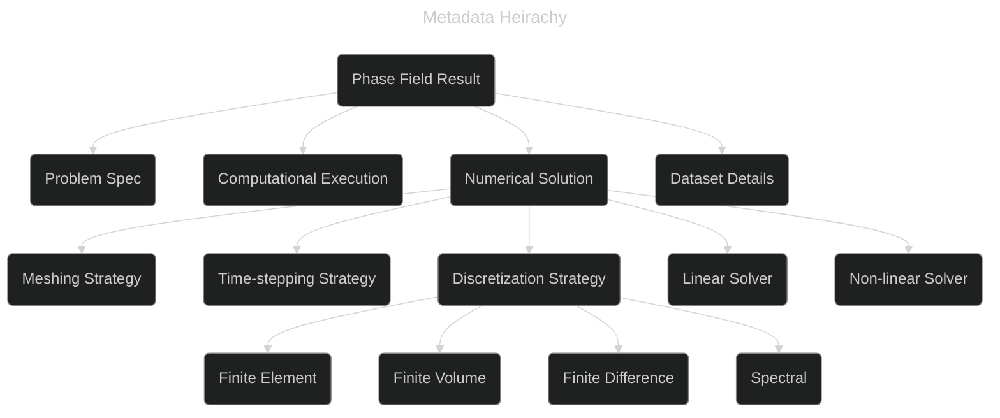

# Phase Field Metadata Working Group

## 2024 MaRDA Meet

[https://github.com/marda-alliance/phase-field-schema]{style="color: #7ec1d7"} :inline-component{prop="value"}

<!--

 - I've been interested in the topic of simulation metadata and how to
   capture that in workflows for a long time, but haven't had a venue
   to work on this so I'm greatful for that MaRDA is providing these
   working groups and that others the other team members are
   interested.
 - The working group started back in September, but a lot of the
   initial meetings were about defining the scope
 - We've got the ball rolling more in recent meetings.
 - The working group has now had 6 one hour meetings
 - This will contain some motivation, our current progress and our plans
 

-->

---
layout: center
---

**Group Members**

 - Stephen DeWitt, ORNL
 - Trevor Keller, NIST
 - Kasra Momeni, U of Alabama
 - Hafiz Noman, KIT
 - Michael Selzer, KIT
 - Marvin Tegeler, OpenPhase Solutions
 - Kaysuyo Thornton, U of Michigan
 - Zach Trautt, NIST
 - Daniel Wheeler, NIST
 - Olga Wodo, U at Buffalo
 
<!--

- We currently have 10 active members for the group
- A number of these participants have joined from the phase field
  workshops that have designed the phase field benchmarks
- We are mostly domain experts in phase field
- Michael Selzer and Hafiz Noman recently joined
  - They have experience in designing ontologies
- Likewise having Zach involved is very useful
- We need some experience in designing ontolgies and using web
  semantic technology

-->

---
layout: figure-side
figureUrl: ./images/Selection_001.png
figureCaption: "PFHub Benchmark 1b with data from 20 sources required to be machine readable"
---

   

**Motivation**

- No widely used semantic web standard for materials simulation metadata
- Phase field is a convenient place to start
- Background wrangling data for phase field benchmarks

<!--

- At least form my perspective I don't see a widely used standard for
  materials simulation metadata and this can help the platforms and
  tools that we're currently using.
- The tool & platform developers would like to not think about the
  standards if possible
- In the long run the way this issue might be addressed is by small
  groups coming up with a solution and then eventually merging these
  standards.
- My background and interest comes out of wrangling data for the PFHub project.
- The image on the right shows a result to the Cahn-Hilliard
  benchmaking involving merging 20 different submissions.
- It was extremely difficult to arrive on a standard even for this
  relatively straight forward problem and well specified problem.
  
-->

---
layout: center
---

**Vision**

- Generate a metadata standard for phase field data
  - Use current semantic web technologies
- Adopt metadata standard for some published use cases
- *Possibly* provide a template for FAIR metadata standards for
  materials simulation

<!--

- We want to create a standard using current semantic web technology
- We'd like to adopt this standard for some published used cases that
  I'll described in the next few slides
- Maybe we could use this as a standard for other materials simulation or
  merge with a wider field of metadata

-->

---
layout: center
---

data dictionary /   semantic data dictionary /   schema /   ontology

**Vision**

- Generate a  metadata standard  for phase field data
  - Use current semantic web technologies
- Adopt metadata standard for some published use cases
- *Possibly* provide a template for FAIR metadata standards for
  materials simulation

<!--

- Note that we could replace metadata standard with any one of those
  terms, but the most applicable might be semantic data dictionary
- An important consideration is how lightweight we want to go. I am on
  the side of having a more lightweight schema
- A sort of model for me is the codemeta project. The aim being to add
  an easily generated JSON file alongside exisiting codes in Github to
  provide more context.
- We want to provide an easily generated JSON file that could sit
  alongside generated phase field data in services like Zenodo.

-->

---
layout: figure-side
figureUrl: ./images/Selection_002.png
figureCaption: "Initial attempt at a glossary of phase field terms"
---

 

**Accomplishments**

- Proposal
- 5 use cases
- List of relevant literature
- Glossary and loose hierarchy
- Tentative attempts using semantic web tech (schema.org)

<!--

- Our work thus far has consisted of drafting a proposal which is on the github page
- Some use cases that I'll discuss on the next slide
- A list of relevant litreature
- We took a step back recently with some prompting from Michael Selzer
  and started thinking about a glossary of terms and then coming up
  with a loose heirachy
- thinking mostly about the high level categories.
- We've also played with using Schema.org to generate a schema
- image on the right shows some of the glossary of phase field terms
- the majority of this is generated by ChatGPT
  - great use of ChatGPT to avoid missing categories or concepts

-->
---
layout: center
---

**Use cases**

- AI
- Research Project Data Management
- Performance Comparison
- Materials Design Workflow
- Phase Field Benchmarks

<!--

- We have 5 use cases that members of the team have created
- The use cases are basically 1 or 2 page documents that we have in the repository
- They have some context, identify the key issue with regards to metadata and then identify
  what in particular would be useful in the schema for that use case.
- For example the AI use case identifies that it is important to
  identify a sample axis, a feature axis and how the data is
  labeled.
- The data management use case cares more about
  identifying simulations based on the problem specification (search
  based on paramemter changes)

-->

---

<!--

- This shows the sort of loose hierarchy that we're stating to create
- Essentially, we're dividing a phase field result into 4 subcategories
- it is fairly obvious how to break it up a the high level
- The problem spec is by far the hardest section. In fact we've been
  thinking of keeping that to a link to a DOI or some other
  description and keywords.  Dataset details may be the easier at
  there are a number of semantic web standards already for this.
- Computational execution (or environment) is also quite tractable

-->

---
layout: figure-side
figureUrl: ./images/Levels-of-semantic-systems-Source-Geoff-Gross-Osthus.png
figureCaption: "From \"Report on Workshop on Interoperability in Materials Modelling\", doi:10.5281/zenodo.1240229"
---

  

**Work Plan**

- Continue monthly meetings (6 so far)
- Complete metadata hierarchy
- Implement with semantic web tech
- Generate use cases / working examples using metadata standard and document
- Publication and disseminate

<!--

- We're continuing with the monthly meetings
- We have currently divided the group into the main 4 sections of the
  schema to work on separate parts
- Once we have a settled hierarchy of terms then we can iterate this
  with the semantic web tech such as datacite and/or schema.org
- The last step is to generate example using the schema from some of
  our use cases

-->

---
layout: end
---

Please join the group if you're interested in simulation metadata

