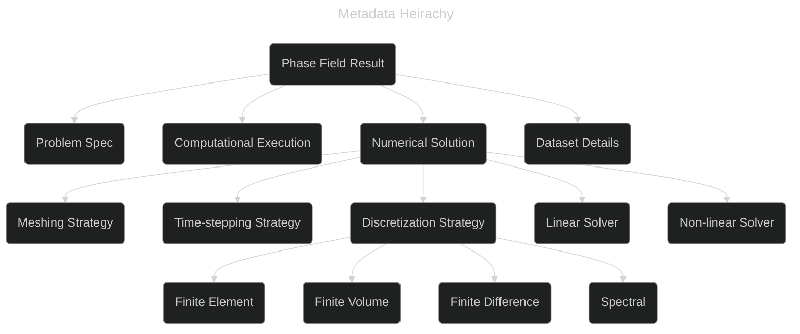

# Phase Field Metadata Working Group

## 2024 MaRDA Meet

[https://github.com/marda-alliance/phase-field-schema]{style="color: #848482"} :inline-component{prop="value"}

---
layout: center
---

<!-- <template v-slot:default> -->

<!-- **Group Admin** -->

<!--  * Meet 1 hour once a month -->
<!--  * First meet: 09/21/2023 -->
<!--  * 6 meetings so far -->
<!--  * 10 members -->

<!--  </template> -->
<!-- <template v-slot:right> -->

**Group Members**

 - Stephen DeWitt, ORNL
 - Trevor Keller, NIST
 - Kasra Momeni, U of Alabama
 - Hafiz Noman, KIT
 - Michael Selzer, KIT
 - Marvin Tegeler, OpenPhase Solutions
 - Kaysuyo Thornton, U of Michigan
 - Zach Trautt, NIST
 - Daniel Wheeler, NIST
 - Olga Wodo, U at Buffalo
 
<!-- </template> -->

---
layout: figure-side
figureUrl: ./images/Selection_001.png
figureCaption: "PFHub Benchmark 1b with data from 20 sources required to be machine readable"
---

   

**Motivation**

- No widely used semantic web standard for materials simulation metadata
- Phase field is a convenient place to start
- Background wrangling data for phase field benchmarks

---
layout: center
---

**Goals**

- Generate a metadata standard for phase field data
  - Use current semantic web technologies
- Adopt metadata standard for some published use cases
- *Possibly* provide a template for FAIR metadata standards for
  materials simulation

---
layout: center
---

data dictionary /   semantic data dictionary /   schema /   ontology

**Goals**

- Generate a  metadata standard  for phase field data
  - Use current semantic web technologies
- Adopt metadata standard for some published use cases
- *Possibly* provide a template for FAIR metadata standards for
  materials simulation

---
layout: figure-side
figureUrl: ./images/Selection_002.png
figureCaption: "Initial attempt at a glossary of phase field terms"
---

 

**Accomplishments**

- Proposal
- 5 use cases
- Literature review
- Glossary
- Loose hierarchy
- Tentative attempts using semantic web tech (schema.org)

---
layout: center
---

**Use cases**

- AI
- Data Management
- Performance Comparison
- Materials Design Workflow
- Phase Field Benchmarks

---

---
layout: figure-side
figureUrl: ./images/Levels-of-semantic-systems-Source-Geoff-Gross-Osthus.png
figureCaption: "From \"Report on Workshop on Interoperability in Materials Modelling\", doi:10.5281/zenodo.1240229"
---

  

**Work Plan**

- Continue monthly meetings (6 so far)
- Complete metadata hierarchy
- Implement with semantic web tech
- Generate use case / working examples using metadata standard and document
- Publication and disseminate

---
layout: end
---

Please join the group if you're interested in simulation metadata

<!-- --- -->

<!-- Timeline -->

<!-- --- -->

<!-- **Literature that influences us** -->

<!-- - data dictionaries -->
<!-- -  -->

